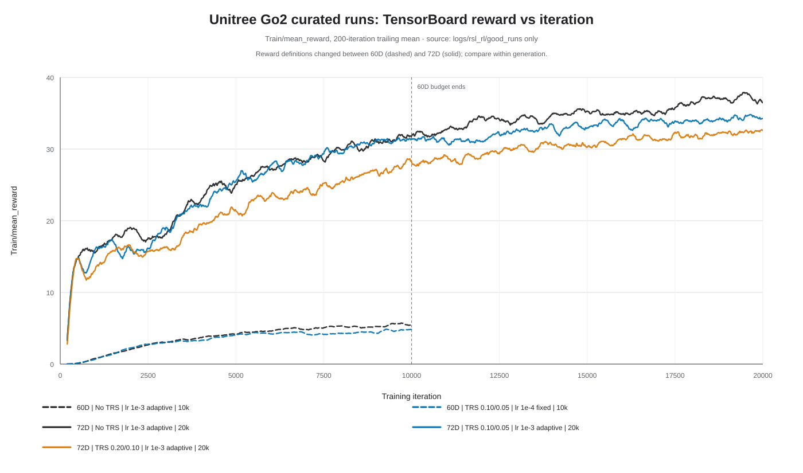
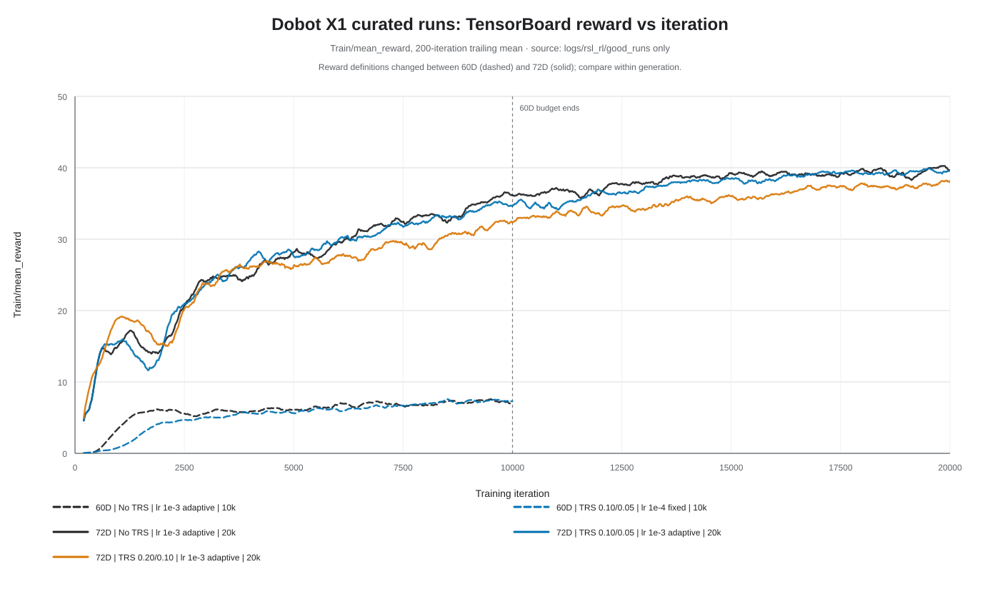

<!--
Copyright (c) 2022-2026, The Isaac Lab Project Developers
(https://github.com/isaac-sim/IsaacLab/blob/main/CONTRIBUTORS.md).
All rights reserved.

SPDX-License-Identifier: BSD-3-Clause
-->

# Curated TensorBoard reward comparison

Date: 2026-07-30

This report compares every TensorBoard run physically archived under
`logs/rsl_rl/good_runs`: five Unitree Go2 runs and five Dobot X1 runs. It
excludes routine runs elsewhere in `logs/rsl_rl`, even when those runs appear
in the broader TRS-grid report.

## Reward by training iteration





The solid 72D curves form the controlled comparison: all use seed 42, 512
environments, 24 steps per environment, a 20,000-iteration budget, adaptive
learning rate starting at `1e-3`, a 500-iteration TRS warm-up, and minimum
absolute command velocity zero. Only the mirror/value TRS coefficients change.

The dashed 60D curves are historical context, not a controlled TRS ablation.
Their no-TRS and TRS runs differ in PPO implementation, learning rate,
schedule, command sampling, and reset perturbations. The 60D and 72D reward
definitions also differ, so their raw reward magnitudes must not be compared
across generations.

## Measurements

| Robot | Generation | Condition | Learning rate / schedule | Budget | AUC, first 10k | Full AUC | Final reward | Reward 30 | Reward 35 |
| --- | --- | --- | --- | ---: | ---: | ---: | ---: | ---: | ---: |
| Go2 | 60D | No TRS | `1e-3` / adaptive | 10k | 3.73 | 3.73 | 5.49 +/- 0.30 | -- | -- |
| Go2 | 60D | TRS `0.10 / 0.05` | `1e-4` / fixed | 10k | 3.36 | 3.36 | 4.74 +/- 0.27 | -- | -- |
| Go2 | 72D | No TRS | `1e-3` / adaptive | 20k | 24.09 | 29.51 | 37.06 +/- 1.12 | 8,661 | 17,239 |
| Go2 | 72D | TRS `0.10 / 0.05` | `1e-3` / adaptive | 20k | 23.64 | 28.31 | 34.45 +/- 0.95 | 8,173 | -- |
| Go2 | 72D | TRS `0.20 / 0.10` | `1e-3` / adaptive | 20k | 20.59 | 25.61 | 32.39 +/- 1.16 | 13,563 | -- |
| X1 | 60D | No TRS | `1e-3` / adaptive | 10k | 5.92 | 5.92 | 7.30 +/- 0.45 | -- | -- |
| X1 | 60D | TRS `0.10 / 0.05` | `1e-4` / fixed | 10k | 5.29 | 5.29 | 7.33 +/- 0.43 | -- | -- |
| X1 | 72D | No TRS | `1e-3` / adaptive | 20k | 26.06 | 32.24 | 39.61 +/- 0.87 | 6,302 | 9,232 |
| X1 | 72D | TRS `0.10 / 0.05` | `1e-3` / adaptive | 20k | 25.92 | 31.88 | 39.58 +/- 0.69 | 6,444 | 11,189 |
| X1 | 72D | TRS `0.20 / 0.10` | `1e-3` / adaptive | 20k | 24.87 | 30.29 | 37.70 +/- 0.80 | 8,322 | 13,612 |

The plotted value is `Train/mean_reward` with a 200-iteration trailing mean.
AUC is the iteration-normalized trapezoidal mean reward, so it remains in
reward units. Final reward is the mean and population standard deviation over
the last 1,000 raw iterations. A threshold iteration is reported only when the
200-iteration trailing mean first reaches the threshold and remains there for
the following 500 iterations. `--` means that criterion was not met.

The full-precision values and resolved parameters are in
[`training_reward_summary.csv`](curated_tensorboard/training_reward_summary.csv).

## Analysis

### Unitree Go2

The 72D no-TRS run has the best overall learning efficiency and endpoint. Low
TRS (`0.10 / 0.05`) reaches reward 30 about 5.6% earlier, but its full AUC is
4.1% lower and its final reward is 7.0% lower; it never sustains reward 35.
High TRS (`0.20 / 0.10`) reduces full AUC by 13.2% and final reward by 12.6%,
reaches reward 30 about 56.6% later, and also never sustains reward 35.

The legacy 60D TRS curve has 9.9% lower AUC than its no-TRS neighbor, but the
configuration differences listed above prevent attributing that gap to TRS.

### Dobot X1

The 72D no-TRS run again has the best overall learning efficiency. Low TRS
finishes essentially tied in reward (0.1% lower), but has 1.1% lower full AUC
and reaches sustained reward 35 about 21.2% later. High TRS has 6.0% lower full
AUC, 4.8% lower final reward, and reaches reward 35 about 47.4% later.

The legacy 60D TRS curve has 10.7% lower AUC, while its endpoint is effectively
tied with no TRS. This comparison remains confounded and is descriptive only.

### Conclusion and limits

Within the controlled curated 72D runs, increasing TRS from off to
`0.10 / 0.05` or `0.20 / 0.10` does not improve overall reward learning
efficiency for either robot. Go2 shows one narrow exception--the low-TRS run
crosses reward 30 earlier--but that advantage does not persist at the higher
threshold or endpoint.

Each configuration has one seed, and adjacent training iterations are
serially correlated. The results characterize these archived runs rather than
estimating population-level uncertainty. They also do not establish a
cross-generation improvement because the 60D and 72D reward/controller
definitions changed.

## Provenance and regeneration

The exact archived run names and the 60D-to-72D configuration changes are
documented in the [milestone report](MILESTONE_60D_TO_72D.md). Each run's
`params/agent.yaml` is the authority for the parameters shown here.

Regenerate the figures and CSV from the repository root with:

```powershell
.\isaaclab.bat -p scripts\symm_locomotion\plot_good_runs_tensorboard.py
```

The exporter walks only `logs/rsl_rl/good_runs`, requires exactly one
TensorBoard event file and one `params/agent.yaml` per selected run, and fails
if either robot does not have the expected five curated runs.
