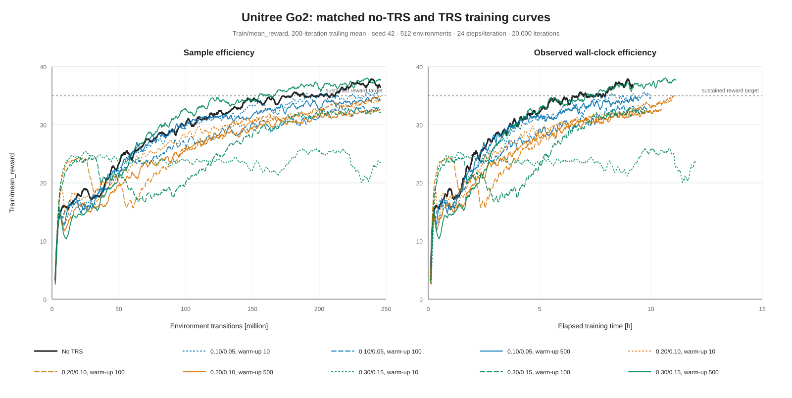
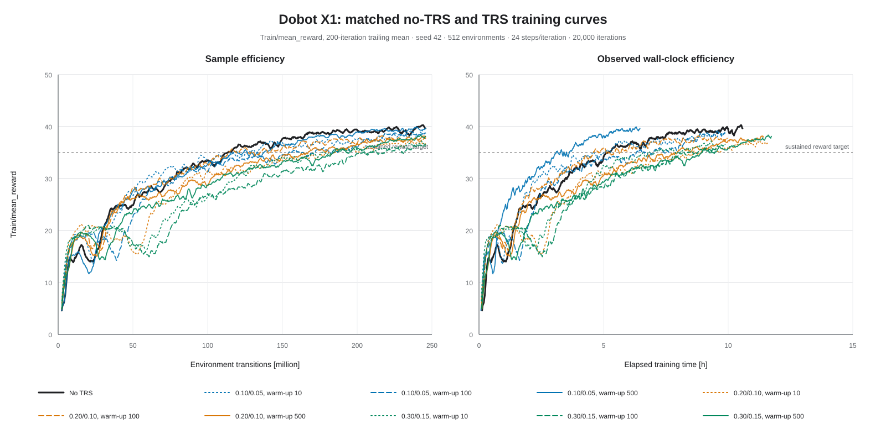

<!--
Copyright (c) 2022-2026, The Isaac Lab Project Developers
(https://github.com/isaac-sim/IsaacLab/blob/main/CONTRIBUTORS.md).
All rights reserved.

SPDX-License-Identifier: BSD-3-Clause
-->

# TRS 0.30/0.15 training-efficiency comparison

Date: 2026-07-22

This report compares training efficiency for the four updated 72D policies in
the [front/hind leg-usage comparison](TRS_0P30_0P15_LEG_USAGE.md): no TRS and
one TRS setting for Unitree Go2 and Dobot X1. The TRS setting is the single
coefficient pair `mirror_loss_coeff=0.30` and `value_loss_coeff=0.15`.

The short result is robot-dependent:

- **Go2:** TRS was clearly more sample-efficient, but processed samples more
  slowly. Its wall time to a reward target is therefore roughly tied and
  depends on the convergence rule. It gave a slightly better endpoint after
  using the same 245.76 million transitions, while the complete 20,000-iteration
  run took 20.7% longer.
- **X1:** no TRS was more efficient by every primary measure. It learned faster
  in both transitions and wall time, processed samples faster, and finished
  with better reward and tracking metrics.

The full coefficient/warm-up scan makes the qualification important: Go2 reward
AUC improved in only 1 of 9 TRS cells (this `0.30 / 0.15`, warm-up 500 cell),
whereas X1 reward AUC improved in 0 of 9. See the
[full grid report](trs_grid_analysis/REPORT.md) for every cell.

## TensorBoard plots

The plots export `Train/mean_reward` directly from all matched TensorBoard event
files with a 200-iteration trailing mean. The left panel uses environment
transitions, which is the primary sample-efficiency comparison. The right panel
uses observed wall time, which is secondary because machine load and shared-GPU
contention differed across scan dates.





## Compared runs and training budget

| Robot | Condition | Training run | TensorBoard event file |
| --- | --- | --- | --- |
| Go2 | No TRS | `2026-07-19_10-32-57_go2_no_trs_pitch0p50_pterm1p20` | `events.out.tfevents.1784453583.National_Grid_6.40932.0` |
| Go2 | TRS | `2026-07-21_22-36-39_go2_trs_m0p30_v0p15_w500` | `events.out.tfevents.1784644606.National_Grid_6.30448.0` |
| X1 | No TRS | `2026-07-19_10-33-04_x1_no_trs_pitch0p35` | `events.out.tfevents.1784453591.National_Grid_6.41688.0` |
| X1 | TRS | `2026-07-21_22-37-01_x1_trs_m0p30_v0p15_w500` | `events.out.tfevents.1784644627.National_Grid_6.5720.0` |

The raw event files remain in their local run directories; they are intentionally
not duplicated into Git because each is about 100 MB. The plots, derived metrics,
and exact relative source paths in
[`summary.json`](trs_grid_analysis/summary.json) are curated here instead.

All runs used seed 42, 512 environments, 24 environment steps per iteration,
and 20,000 iterations. Each therefore consumed

```text
512 * 24 * 20,000 = 245,760,000 environment transitions
```

The PPO architecture, learning-rate schedule, and reward configuration match
within each robot comparison. Apart from run/log paths and the documented
`morphological_symmetry` to `leg_permutation_symmetry` alias, the active TRS
runs add mirror-policy and time-reversed-value losses after a 500-iteration
warm-up. Each TensorBoard series is complete and uninterrupted from iteration
0 through 19,999.

## Measurement method

Training efficiency is separated into three questions:

1. **Sample efficiency:** how many environment transitions are required to
   reach fixed reward or task-quality thresholds?
2. **Compute efficiency:** how many samples are processed per second, and how
   long does training take?
3. **Endpoint quality:** what performance is reached after the identical
   245.76-million-transition budget?

Thresholds use a trailing 200-iteration arithmetic mean and must remain beyond
the threshold for the following 500 iterations. The selected thresholds are
common to all runs and have direct interpretations:

- `Train/mean_reward >= 30` for an intermediate return;
- `Train/mean_reward >= 35` for a mature return;
- `Diagnostics/straight_line_reward >= 1.5` for mature task quality.

One iteration corresponds to 12,288 transitions. Curve area under the curve
(AUC) is normalized by iteration span, so it is the mean logged value over the
training budget rather than an extensive total. Endpoint values are the mean
and population standard deviation over the final 1,000 iterations.

## Sample and wall-clock efficiency

Values are `iteration / million transitions / elapsed hours` at the first
sustained threshold crossing.

| Robot | Condition | Mean reward 30 | Mean reward 35 | Straight-line reward 1.5 |
| --- | --- | ---: | ---: | ---: |
| Go2 | No TRS | 8,661 / 106.4 M / 4.04 h | 17,239 / 211.8 M / 7.95 h | 11,523 / 141.6 M / 5.35 h |
| Go2 | TRS `0.30 / 0.15` | 7,150 / 87.9 M / 4.07 h | 13,491 / 165.8 M / 7.54 h | 7,852 / 96.5 M / 4.46 h |
| X1 | No TRS | 6,302 / 77.4 M / 3.53 h | 9,232 / 113.4 M / 5.17 h | 7,539 / 92.6 M / 4.22 h |
| X1 | TRS `0.30 / 0.15` | 8,857 / 108.8 M / 5.21 h | 14,984 / 184.1 M / 8.93 h | 10,436 / 128.2 M / 6.16 h |

Relative to no TRS:

| Robot | Threshold | TRS transition change | TRS elapsed-time change | Outcome |
| --- | --- | ---: | ---: | --- |
| Go2 | Mean reward 30 | -17.4% | +0.8% | Fewer samples; wall time tied |
| Go2 | Mean reward 35 | -21.7% | -5.1% | TRS faster under this rule |
| Go2 | Straight-line reward 1.5 | -31.9% | -16.7% | TRS faster |
| X1 | Mean reward 30 | +40.5% | +47.4% | TRS slower |
| X1 | Mean reward 35 | +62.3% | +72.7% | TRS slower |
| X1 | Straight-line reward 1.5 | +38.4% | +45.9% | TRS slower |

Go2 TRS learned more slowly during roughly the first 4,000 iterations, then
overtook no TRS. Under the sustained-crossing rule above, its transition
savings offset the lower throughput at the mature thresholds. The sample-count
result is robust to a simpler convergence definition, but the wall-time result
is not: at the first crossing of a 500-iteration moving mean of reward 35, Go2
no TRS reaches the target at iteration 14,662 (6.77 h), while TRS reaches it at
iteration 12,847 (7.19 h). Thus TRS still saves 12.4% of samples but takes 6.1%
longer on that clock-time definition. X1 remains clearly worse with TRS under
the same alternative rule: iteration 9,369 (5.25 h) without TRS versus 15,124
(9.02 h) with TRS. X1 TRS remained behind throughout most of training and did
not recover the no-TRS endpoint.

## Endpoint quality and learning-curve AUC

| Robot | Condition | Final mean reward | Reward AUC | Final episode length [steps] | Final straight-line reward | Final planar velocity error [m/s] |
| --- | --- | ---: | ---: | ---: | ---: | ---: |
| Go2 | No TRS | 37.06 +/- 1.12 | 29.51 | 1,407.9 +/- 34.2 | 1.5440 | 0.1216 |
| Go2 | TRS `0.30 / 0.15` | 37.62 +/- 0.88 | 29.86 | 1,426.5 +/- 27.9 | 1.5589 | 0.1181 |
| X1 | No TRS | 39.61 +/- 0.87 | 32.24 | 1,458.4 +/- 23.5 | 1.5724 | 0.1140 |
| X1 | TRS `0.30 / 0.15` | 37.90 +/- 0.81 | 29.16 | 1,452.8 +/- 24.4 | 1.5514 | 0.1258 |

For Go2, TRS increased reward AUC by 1.2% and final mean reward by 1.5%,
while slightly improving episode length, task reward, and planar tracking. Its
reward and episode-length fluctuations were also smaller in the final window.
These are modest endpoint gains rather than a major change in achievable
performance.

For X1, TRS reduced reward AUC by 9.5% and final mean reward by 4.3%. The final
straight-line reward was 1.3% lower, and planar velocity error was 10.4% higher.
The small reduction in final reward variance does not compensate for the lower
mean or slower learning.

## Compute throughput

| Robot | Condition | Mean throughput [transitions/s] | Full run [h] | Collection [s/iteration] | PPO learning [s/iteration] |
| --- | --- | ---: | ---: | ---: | ---: |
| Go2 | No TRS | 7,683 | 9.20 | 1.497 | 0.104 |
| Go2 | TRS `0.30 / 0.15` | 6,379 | 11.10 | 1.742 | 0.188 |
| X1 | No TRS | 6,836 | 10.58 | 1.694 | 0.141 |
| X1 | TRS `0.30 / 0.15` | 6,064 | 11.74 | 1.848 | 0.198 |

TRS reduced mean throughput by 17.0% for Go2 and 11.3% for X1. The logged PPO
learning phase itself was 80.2% longer per iteration for Go2 and 39.9% longer
for X1, consistent with the extra mirror and time-reversed-value passes. The
complete fixed-budget runs took 20.7% and 11.0% longer, respectively.

Wall time is secondary evidence. Each Go2/X1 pair trained concurrently on the
same host and the same configured `cuda:0`; the X1 job then continued alone
after its paired Go2 job finished. Consequently, shared-GPU contention and
changing machine load contribute to the observed collection time and FPS; they
are not pure algorithm benchmarks. Transition-count comparisons are less
sensitive to this issue.

## Interpretation

### Go2

TRS improves **sample efficiency** and gives a small final-quality gain, but it
reduces **compute throughput**. If environment transitions or simulator samples
are the scarce resource, the TRS run is preferable. If the policy must always
run the full 20,000 iterations and elapsed compute time is the only objective,
no TRS is cheaper. With early stopping, TRS reaches a mature reward in fewer
iterations, but the observed wall time is close enough to change sign under
reasonable convergence definitions. These runs therefore do not support an
unqualified Go2 wall-clock-efficiency advantage.

### X1

No TRS dominates this comparison. It reaches all three thresholds with fewer
transitions and less wall time, runs at higher throughput, and achieves better
final reward and tracking. The `0.30 / 0.15` TRS setting is not training-efficient
for X1 in this seed.

## Evidence limits

Each condition contains only one trained seed. Iterations within a curve are
serially correlated measurements of one optimization run, not independent
replicates. The differences are descriptive and cannot establish an expected
TRS effect over random initialization and environment stochasticity.

A confirmatory comparison should train at least eight paired seeds per
condition, preserve the concurrent-job schedule or benchmark each run alone,
and report paired distributions of transition-to-threshold, wall time,
reward/tracking AUC, and final evaluation performance. Training efficiency and
the separate playback leg-usage outcome should remain distinct endpoints.
