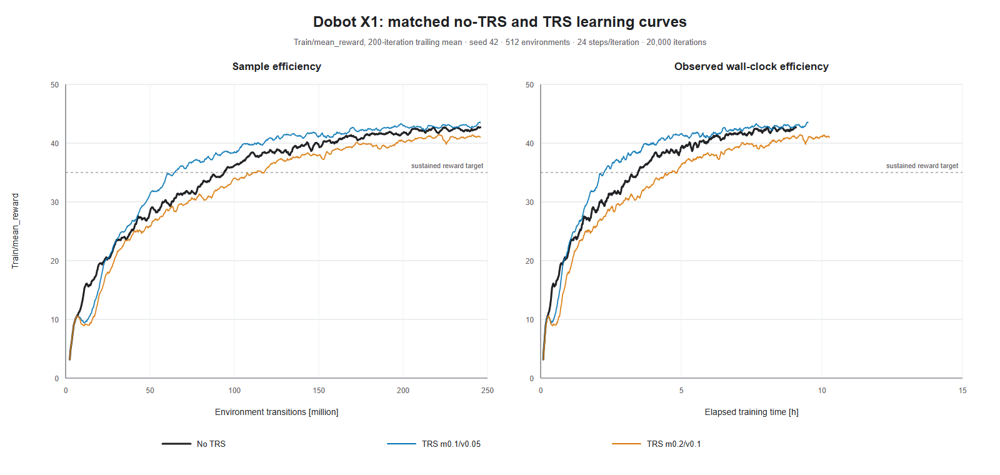
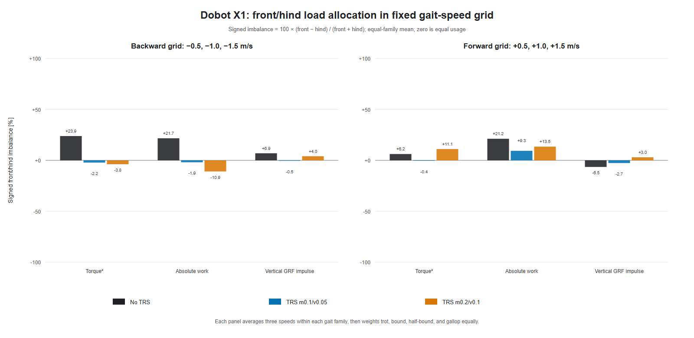

# Dobot X1 gait-family V2 analysis

This study compares the latest 3 archived X1 runs. The learning plot retains the earlier good-runs style. The leg-usage plot retains its two-direction grouped-bar style, but replaces the incidental `-0.567/+1.682 m/s` playback samples with the controlled 10-gait grid at `vx = ±{0.5, 1.0, 1.5} m/s`.





## Training efficiency

| Run | AUC first 10k | AUC full | Last-1k reward | Sustained reward 35 [M transitions] |
|---|---:|---:|---:|---:|
| No TRS | 28.248 | 34.667 | 42.307 ± 0.743 | 93.95 |
| TRS m0.1/v0.05 | 30.024 | 36.124 | 43.040 ± 0.667 | 64.79 |
| TRS m0.2/v0.1 | 25.844 | 32.683 | 41.081 ± 0.726 | 117.66 |

## Family-balanced fixed-grid leg usage

Lower is better. Imbalance is the equal-family mean of each cell's absolute front/hind imbalance; exposure is the equal-family, equal-direction mean per actual directed metre. Exact values for every signed velocity and gait family are retained in `front_hind_command_summary.csv`.

| Run | Torque² imbalance | Work imbalance | GRF imbalance | Torque² / m | Work [J/m] | GRF [N·s/m] |
|---|---:|---:|---:|---:|---:|---:|
| No TRS | 17.687% | 23.917% | 6.999% | 374.302 | 192.681 | 214.892 |
| TRS m0.1/v0.05 | 6.642% | 12.800% | 3.806% | 350.079 | 183.973 | 211.855 |
| TRS m0.2/v0.1 | 9.549% | 18.952% | 4.270% | 424.187 | 257.678 | 212.898 |

## Integrity and interpretation

| Run | Valid grid cells | Planar pass | Yaw + planar pass |
|---|---:|---:|---:|
| No TRS | 60/60 | 60/60 | 39/60 |
| TRS m0.1/v0.05 | 60/60 | 60/60 | 56/60 |
| TRS m0.2/v0.1 | 60/60 | 60/60 | 44/60 |

All 180 cells are valid and pass the speed-dependent planar tracking threshold. The main allocation summary therefore uses the common 60-cell planar set; heading/yaw success is reported separately and is not silently used to select a different subset for each policy.

The `m0.1/v0.05` policy is the observed Pareto winner: it has the best early/full AUC and tail reward, reaches sustained reward 35 with the fewest samples, and has the lowest family-balanced imbalance and per-metre exposure for all three reported physical metrics. The stronger `m0.2/v0.1` setting remains better balanced than no TRS but gives back learning efficiency and raises torque/work exposure.

Normalized torque is intentionally omitted because the recorder stored PhysX sentinel effort limits (`1e9 N·m`), not physical actuator limits. Rainflow fatigue was not generated by the fixed-grid analyzer; neither quantity is reconstructed or fabricated here. Results describe one training seed and one deterministic evaluation seed, so they are checkpoint comparisons rather than statistical method claims.

## Reproduction

From the repository root:

```powershell
.\isaaclab.bat -p .\logs\rsl_rl\good_runs\dobot_x1_symm_flat\gait_famili_v2_analysis\reproduce.py
```

The SVG outputs are always regenerated. PNG previews are regenerated when a local Chromium-family browser is available.
