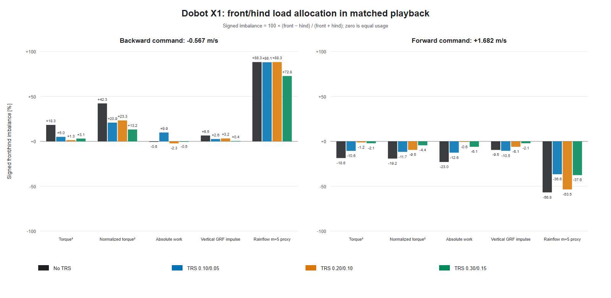
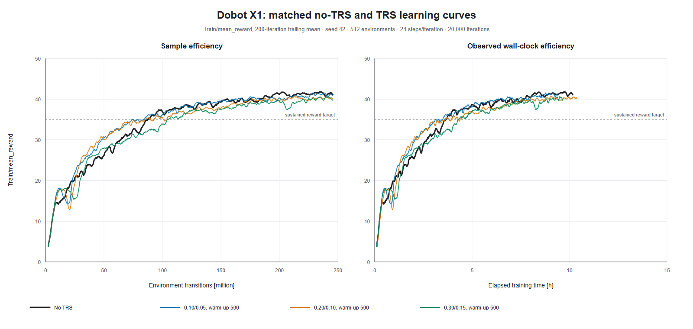

# Dobot X1 four-run TRS load-allocation and sample-efficiency study

Date: 2026-08-03

## Executive conclusion

The four matched X1 runs do not show one TRS setting that dominates every
criterion. They show a coefficient-dependent Pareto trade-off.

- **TRS 0.10/0.05 is the only setting with a useful reward sample-efficiency
  signal.** It improves first-10k reward AUC by 5.03%, full-run AUC by 1.84%,
  and reaches sustained reward 30 with 25.65% fewer samples. It finishes with
  slightly lower reward and worse XY/yaw tracking than No TRS.
- **TRS 0.20/0.10 best reduces cyclic exposure of the most stressed
  component.** Compared with No TRS, total rainflow `m=5`, dominant-pair
  `m=5`, and worst-joint `m=5` proxies fall 16.4%, 17.2%, and 28.3%. The cost is
  19.6% more work, 7.9% more torque-squared exposure, and much larger impact
  forces.
- **TRS 0.30/0.15 gives the broadest front/hind balance and the best impact
  compromise among the TRS policies.** It has the lowest dominant-pair `m=5`
  exposure and best normalized-torque, GRF, and cyclic pair balance. However,
  its worst joint is 3.7% above baseline, its per-leg `m=5` spread is the worst,
  and its learning curve is the weakest.
- **TRS 0.10/0.05 redistributes loads but does not improve the durability
  proxies overall.** Total `m=5` rises 24.2%, dominant-pair `m=5` rises 9.1%,
  and worst-joint `m=5` rises 3.6%.

Therefore, the data support neither a blanket claim that TRS improves X1
training nor a claim that it reduces physical leg-break probability. TRS
0.20/0.10 and 0.30/0.15 reduce different load-concentration proxies, but their
opposing work, impact, and per-leg indicators matter. These are one-seed,
one-playback descriptive results, not hardware failure probabilities.

## Compared runs and controls

| Label | Archived run | Mirror/value coefficient | Warm-up |
|---|---|---:|---:|
| No TRS | `2026-08-02_10-35-06_x1_no_trs_20k_512` | 0 / 0 | 500, inactive |
| TRS 0.10/0.05 | `2026-08-02_21-02-49_x1_trs_m0p1_v0p05_w500_minv0_20k_512` | 0.10 / 0.05 | 500 |
| TRS 0.20/0.10 | `2026-08-02_10-28-45_x1_trs_m0p2_v0p10_w500_minv0_20k_512` | 0.20 / 0.10 | 500 |
| TRS 0.30/0.15 | `2026-08-02_21-07-58_x1_trs_m0p3_v0p15_w500_minv0_20k_512` | 0.30 / 0.15 | 500 |

The comparison is strongly controlled:

- every run uses seed 42, 512 environments, 24 steps per environment, and
  20,000 iterations: 12,288 transitions per iteration and 245.76 million
  transitions total;
- every run has 21 checkpoints through `model_19999.pt`, one complete event
  file, 20,000 reward points at iterations 0 through 19,999, and no nonfinite
  TensorBoard scalars;
- all four `model_0.pt` files are byte-identical
  (`2089a92bd6992ab581c6dec01b70fdd7b87ca93d93f9cf521d0506c18b1249af`);
- actor/critic input dimensions remain 72, the action dimension is 12, and the
  network/PPO settings are shared;
- resolved environment YAML files are identical after normalizing only
  `log_dir`, and resolved agent YAML files are identical after normalizing the
  run name and intended TRS enable/coefficient fields;
- `use_data_augmentation=false`, `min_abs_command_velocity=0.0`, and
  `min_xy_command_norm=0.0` in every run; and
- the archived environment uses
  `phase_mapping_version=same_gait_backward_duty_aware_trs_v2`.

The raw archived provenance-diff files are not byte-identical because their
embedded `git status` preambles list different untracked archive directories.
After selecting the training-source sections under `scripts/symm_locomotion/`
and `source/isaaclab_tasks/`, all four hashes are identical:
`c1e2b996d806655b4af21ee1f35ece43ed557bb21c7f28386d9563abb88dcb01`.
This distinction is recorded explicitly in `summary.json`; no tracked
training-source difference was detected.

The no-TRS run is operationally inactive: mirror loss is disabled, both
coefficients are zero, symmetry loss remains zero, and there is no TR-value
loss tag. In every TRS run, both auxiliary losses are zero through iteration
499 and first become nonzero at iteration 500. Rewards are identical through
iteration 500 and first differ at iteration 501.

## Matched playback and method

Each final-policy archive contains 1,500 samples over 30 seconds at 50 Hz. The
byte-matched command schedule is:

- backward: `vx=-0.566558 m/s`, `vy=0`, `yaw=0`, through 9.96 s;
- forward: `vx=+1.681907 m/s`, `vy=0`, `yaw=0`, from 9.98 s onward.

Steady windows are `[0.5, 9.5)` seconds backward and `[10.5, 29.5)` seconds
forward. All policies survive to the common final time limit with no episode
end inside either window. Time, commands, desired path, terminal flags, gait
targets, clearance targets, swing weights, joint limits, and joint/leg order
are byte-identical across runs.

Front means FL+FR and hind means RL+RR. Signed pair imbalance is

```text
100 * (front - hind) / (front + hind)
```

Positive values are front-biased, negative values are hind-biased, and zero is
equal allocation. Direction-equal summaries average the absolute backward and
forward imbalance, preventing the longer forward window from dominating.
Intervals in the CSV use 20,000 one-second temporal block-bootstrap replicates.
They describe within-rollout temporal variation, not uncertainty over training
seeds. Rainflow values are effort-limit-normalized sensitivity proxies, not
Miner damage, S-N life, thermal damage, gearbox life, or fracture probability.

## Are the front and hind legs used more evenly?

Yes at the pair level for most measures, but the best setting depends on the
measure. Direction-equal absolute imbalance is shown below; lower is more even.

| Metric | No TRS | 0.10/0.05 | 0.20/0.10 | 0.30/0.15 |
|---|---:|---:|---:|---:|
| Torque-squared exposure | 18.459% | 7.822% | **1.249%** | 2.607% |
| Normalized torque exposure | 30.726% | 16.295% | 16.406% | **8.820%** |
| Absolute work | 11.775% | 11.247% | **1.445%** | 3.307% |
| Vertical GRF impulse | 8.041% | 6.574% | 4.672% | **1.268%** |
| Rainflow `m=3` proxy | 49.508% | 40.321% | 45.702% | **31.014%** |
| Rainflow `m=5` proxy | 72.577% | 62.367% | 70.928% | **55.206%** |
| Contact duration | 3.000% | **1.982%** | 5.384% | 5.498% |

Relative to No TRS, 0.30/0.15 reduces imbalance by 85.9% for torque-squared,
71.3% for normalized torque, 71.9% for work, 84.2% for vertical GRF, 37.4%
for `m=3`, and 23.9% for `m=5`. The 0.20/0.10 policy is even stronger for
torque-squared (-93.2%) and work (-87.7%). Contact allocation is the exception:
0.10/0.05 is best, whereas 0.20/0.10 and 0.30/0.15 increase its imbalance.

Cyclic specialization remains substantial. Backward `m=5` is front-biased and
forward `m=5` is hind-biased for every policy:

| Policy | Backward absolute imbalance | Forward absolute imbalance |
|---|---:|---:|
| No TRS | 88.328% | 56.826% |
| TRS 0.10/0.05 | 88.100% | **36.634%** |
| TRS 0.20/0.10 | 88.333% | 53.523% |
| TRS 0.30/0.15 | **72.805%** | 37.606% |

Thus 0.30/0.15 gives the broadest front/hind balancing, but none makes cyclic
use close to equal in both directions.



## Is the risk of overloading or breaking one leg pair reduced?

Some concentration proxies fall, but an overall break-risk reduction is not
demonstrated. Combined values below sum both steady windows and normalize by
combined directed distance.

| Combined proxy per directed metre | No TRS | 0.10/0.05 | 0.20/0.10 | 0.30/0.15 |
|---|---:|---:|---:|---:|
| Total torque-squared | 324.141 | **323.405** | 349.676 | 344.667 |
| Normalized torque exposure | 0.62670 | 0.62633 | 0.59484 | **0.56045** |
| Total absolute work [J/m] | 143.024 | **140.559** | 171.089 | 157.300 |
| Total rainflow `m=3` | 2.40232 | 2.76550 | 2.18414 | **2.18390** |
| Total rainflow `m=5` | 1.18594 | 1.47338 | **0.99096** | 1.05837 |
| Dominant-pair rainflow `m=5` | 0.89793 | 0.97993 | 0.74387 | **0.72389** |
| Worst-joint rainflow `m=5` | 0.55017 | 0.57025 | **0.39450** | 0.57047 |
| Vertical GRF impulse [N s/m] | 141.138 | 141.110 | 142.334 | **140.841** |
| Per-leg `m=5` max:min ratio | 4.802 | **3.881** | 4.496 | 5.845 |

The dominant combined pair remains the hind pair. Per-leg combined `m=5`
exposure shows why pair balance alone is insufficient:

| Policy | FL | FR | RL | RR |
|---|---:|---:|---:|---:|
| No TRS | 0.17221 | 0.11580 | **0.55606** | 0.34188 |
| TRS 0.10/0.05 | 0.34487 | 0.14858 | 0.40327 | **0.57665** |
| TRS 0.20/0.10 | 0.15819 | 0.08891 | 0.34416 | **0.39970** |
| TRS 0.30/0.15 | 0.09842 | 0.23606 | 0.14857 | **0.57532** |

The worst joint is the rear-left thigh for No TRS (`0.55017`) and rear-right
thigh for all TRS policies. Only 0.20/0.10 materially lowers that maximum
(`0.39450`, -28.3%). The 0.30/0.15 policy lowers dominant-pair exposure most,
but shifts exposure onto the rear-right thigh (`0.57047`, +3.7%) and produces
the widest per-leg spread.

Impact forces add an opposing failure-mode indicator:

| Command | No TRS | 0.10/0.05 | 0.20/0.10 | 0.30/0.15 |
|---|---:|---:|---:|---:|
| Backward worst-foot p99 [N] | 288.5 | 230.7 | 264.3 | **188.9** |
| Backward peak [N] | 332.5 | **331.0** | 472.4 | 403.7 |
| Forward worst-foot p99 [N] | **278.4** | 405.1 | 513.7 | 298.6 |
| Forward peak [N] | 682.3 | 993.0 | 970.7 | **664.4** |

The 0.10/0.05 and 0.20/0.10 policies raise forward peak impact about 45.5% and
42.3%; 0.20/0.10 raises forward p99 force 84.5%. The 0.30/0.15 policy is the
best TRS impact compromise: its forward peak is 2.6% below baseline, although
its backward peak is 21.4% higher.

Planar tracking RMSE (backward / forward, m/s) is `0.04417 / 0.07787` for No
TRS, `0.03476 / 0.08094` for 0.10/0.05, `0.04147 / 0.07287` for 0.20/0.10,
and `0.02132 / 0.06654` for 0.30/0.15. Every recorded joint-limit,
physical-limit, and target-limit fraction is zero, and all policies survive the
full playback.

The defensible durability result is a Pareto front:

- choose 0.20/0.10 if the priority is reducing cyclic exposure of the worst
  actuator/component, while accepting higher work and impacts;
- choose 0.30/0.15 if the priority is broad pair balance and avoiding the
  extreme forward impacts of the lower TRS coefficients, while accepting a
  concentrated rear-right-thigh exposure; and
- do not select 0.10/0.05 for durability on this evidence alone, despite its
  better redistribution and learning efficiency.

## Does TRS improve training or sample efficiency?

Only the weakest coefficient gives descriptive evidence of better reward
sample efficiency. Thresholds use a trailing 200-iteration mean sustained for
500 iterations. AUC uses raw aligned TensorBoard values. Threshold entries are
iteration / environment transitions.

| Training metric | No TRS | 0.10/0.05 | 0.20/0.10 | 0.30/0.15 |
|---|---:|---:|---:|---:|
| Reward AUC, first 10k | 27.982 | **29.390 (+5.03%)** | 29.028 (+3.74%) | 27.075 (-3.24%) |
| Reward AUC, full 20k | 34.086 | **34.713 (+1.84%)** | 34.126 (+0.12%) | 32.864 (-3.59%) |
| Reward, last 1k | **41.286 +/- 0.739** | 41.094 +/- 0.735 | 40.289 +/- 0.750 | 40.142 +/- 0.775 |
| Sustained reward 30 | 5,231 / 64.28M | **3,889 / 47.79M** | 4,161 / 51.13M | 5,614 / 68.98M |
| Sustained reward 35 | 7,137 / 87.70M | **6,869 / 84.41M** | 7,554 / 92.82M | 8,513 / 104.61M |
| Sustained straight score 1.5 | 6,961 / 85.54M | 5,575 / 68.51M | **4,596 / 56.48M** | 7,185 / 88.29M |
| Sustained XY error <=0.15 | **7,202 / 88.50M** | 9,323 / 114.56M | 8,666 / 106.49M | 9,982 / 122.66M |
| Final XY error | **0.10988** | 0.11267 | 0.11653 | 0.11974 |
| Final yaw error | **0.10762** | 0.10830 | 0.11636 | 0.11768 |

The smoothed 0.10/0.05 curve is above No TRS for 58.14% of aligned points,
but crosses slightly below at iteration 19,555 and ends only 0.077 reward lower.
The 0.20/0.10 curve is above for 33.35%, remains below after iteration 14,833,
and ends 0.821 lower. The 0.30/0.15 curve is above for only 16.54%, remains
below after 10,365, and ends 1.404 lower. None stays above baseline through the
endpoint.

Stronger coefficients monotonically lower the auxiliary residuals: tail-1k
symmetry/value losses are `0.11038/0.001897`, `0.06297/0.001158`, and
`0.04284/0.000909` from weak to strong TRS. Better regularizer satisfaction
does not translate into better task reward or tracking.

The reward sample-efficiency ranking is
`0.10/0.05 > 0.20/0.10 approximately No TRS > 0.30/0.15`; endpoint reward and
tracking rank `No TRS > 0.10/0.05 > 0.20/0.10 > 0.30/0.15`. Wall times
(9.41--10.39 hours) are descriptive only because the runs were executed as two
concurrent cohorts on the same GPU with materially different collection
throughput. Environment transitions are the defensible efficiency axis.



## Limitations

- There is one training seed per condition, so apparent coefficient effects
  are not estimates of population means or uncertainty across seeds.
- The paired playback contains one backward and one forward command, not the
  full speed, gait, terrain, disturbance, or initial-state distribution.
- The NPZ does not independently record checkpoint filename, playback seed,
  initial angular/root state, discrete gait row, or realized disturbance draws.
- Temporal bootstrap intervals quantify variation within these trajectories;
  they do not solve the one-seed limitation.
- Load, work, rainflow, force, and limit metrics are engineering proxies. A
  hardware risk claim requires actuator thermal models, gearbox/bearing limits,
  structural stress/strain or S-N data, impact calibration, and repeated trials.

## Reproduction and outputs

From the repository root in the `symm_rl_isaaclab` environment:

```powershell
python logs/rsl_rl/good_runs/dobot_x1_symm_flat/phase_mapping_v2_x1_trs_run_analysis/reproduce.py
```

The small wrapper invokes the maintained shared engine at
`scripts/symm_locomotion/analyze_matched_trs_study.py`. It loads immutable
robot/run metadata from `study.json`, validates matched artifacts, recomputes
every table, uses a fixed bootstrap seed, and regenerates the SVG figures and
`summary.json`. The raw run directories named by the manifest must be available
locally.

- `front_hind_metrics.csv`: pair totals, per-distance values, imbalance, and
  temporal bootstrap intervals.
- `durability_risk_summary.csv`: tracking, work, force, fatigue, torque, contact,
  and limit diagnostics by window.
- `training_efficiency.csv`: AUC, thresholds, endpoint metrics, timing, and
  training diagnostics.
- `learning_curve_points.csv`: exact displayed smoothed/downsampled curve points
  for all runs.
- `summary.json`: machine-readable methods, validation hashes, rollout results,
  and training results.
- `study.json`: immutable robot/run metadata for the shared analysis method.
- `learning_curve_sample_and_wall_time.svg` and `.png`: four-run learning curves.
- `front_hind_signed_imbalance.svg` and `.png`: four-run load-allocation plot.
