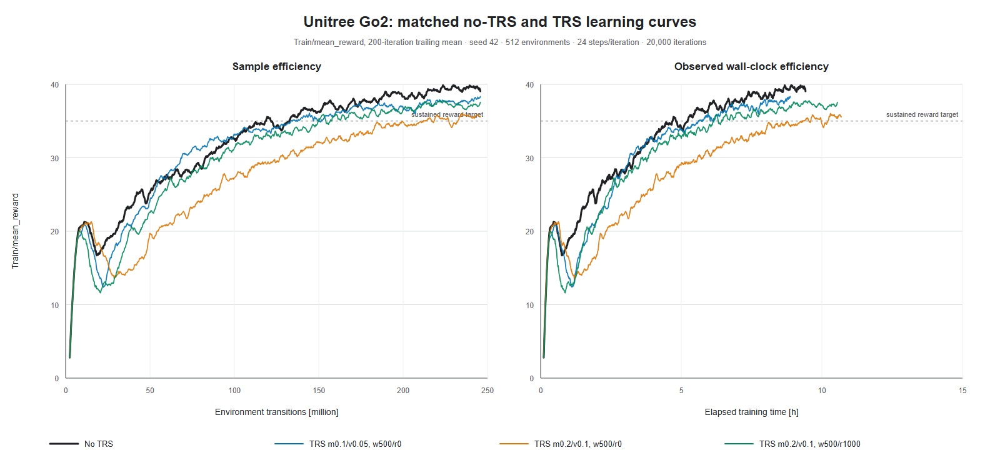
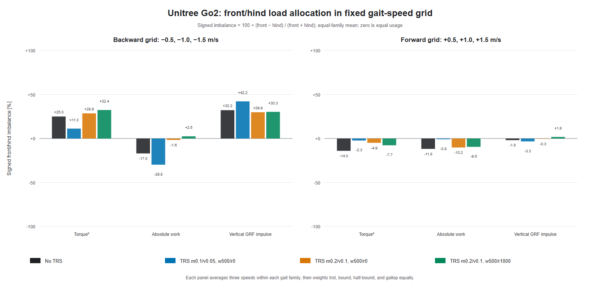

# Unitree Go2 gait-family V2 analysis

This study compares the latest 4 archived Go2 runs. The learning plot retains the earlier good-runs style. The leg-usage plot retains its two-direction grouped-bar style, but replaces the incidental `-0.567/+1.682 m/s` playback samples with the controlled 10-gait grid at `vx = ±{0.5, 1.0, 1.5} m/s`.





## Training efficiency

| Run | AUC first 10k | AUC full | Last-1k reward | Sustained reward 35 [M transitions] |
|---|---:|---:|---:|---:|
| No TRS | 26.394 | 32.084 | 39.493 ± 1.053 | 132.56 |
| TRS m0.1/v0.05, w500/r0 | 25.987 | 31.281 | 37.919 ± 0.979 | 137.40 |
| TRS m0.2/v0.1, w500/r0 | 21.502 | 27.502 | 35.678 ± 1.018 | 218.28 |
| TRS m0.2/v0.1, w500/r1000 | 24.018 | 29.953 | 37.092 ± 1.001 | 156.77 |

## Family-balanced fixed-grid leg usage

Lower is better. Imbalance is the equal-family mean of each cell's absolute front/hind imbalance; exposure is the equal-family, equal-direction mean per actual directed metre. Exact values for every signed velocity and gait family are retained in `front_hind_command_summary.csv`.

| Run | Torque² imbalance | Work imbalance | GRF imbalance | Torque² / m | Work [J/m] | GRF [N·s/m] |
|---|---:|---:|---:|---:|---:|---:|
| No TRS | 20.038% | 17.725% | 18.245% | 588.019 | 238.774 | 186.709 |
| TRS m0.1/v0.05, w500/r0 | 14.088% | 22.037% | 26.029% | 606.785 | 331.854 | 184.383 |
| TRS m0.2/v0.1, w500/r0 | 19.607% | 9.621% | 17.241% | 594.809 | 287.675 | 183.824 |
| TRS m0.2/v0.1, w500/r1000 | 21.106% | 11.668% | 17.664% | 561.987 | 246.428 | 187.225 |

## Integrity and interpretation

| Run | Valid grid cells | Planar pass | Yaw + planar pass |
|---|---:|---:|---:|
| No TRS | 60/60 | 60/60 | 5/60 |
| TRS m0.1/v0.05, w500/r0 | 60/60 | 60/60 | 0/60 |
| TRS m0.2/v0.1, w500/r0 | 60/60 | 60/60 | 0/60 |
| TRS m0.2/v0.1, w500/r1000 | 60/60 | 60/60 | 0/60 |

All 240 cells are valid and pass the speed-dependent planar tracking threshold. The main allocation summary therefore uses the common 60-cell planar set; heading/yaw success is reported separately and is not silently used to select a different subset for each policy.

No single TRS run dominates this four-run Go2 cohort. No TRS remains the strongest learner and has the lowest work per metre. `m0.1/v0.05, w500/r0` provides the best torque-allocation balance and the strongest TRS learning, but worsens work and GRF balance. `m0.2/v0.1, w500/r0` provides the best work and GRF balance but pays the largest reward cost. Adding the `r1000` ramp to `m0.2/v0.1` substantially recovers learning and lowers torque-squared and work exposure per metre, while giving back some of the hard-start run's allocation balance. The result is a measured reward-versus-leg-usage tradeoff, not a universal winner.

Normalized torque is intentionally omitted because the recorder stored PhysX sentinel effort limits (`1e9 N·m`), not physical actuator limits. Rainflow fatigue was not generated by the fixed-grid analyzer; neither quantity is reconstructed or fabricated here. Results describe one training seed and one deterministic evaluation seed, so they are checkpoint comparisons rather than statistical method claims.

## Reproduction

From the repository root:

```powershell
.\isaaclab.bat -p .\logs\rsl_rl\good_runs\unitree_go2_symm_flat\gait_famili_v2_analysis\reproduce.py
```

The SVG outputs are always regenerated. PNG previews are regenerated when a local Chromium-family browser is available.
