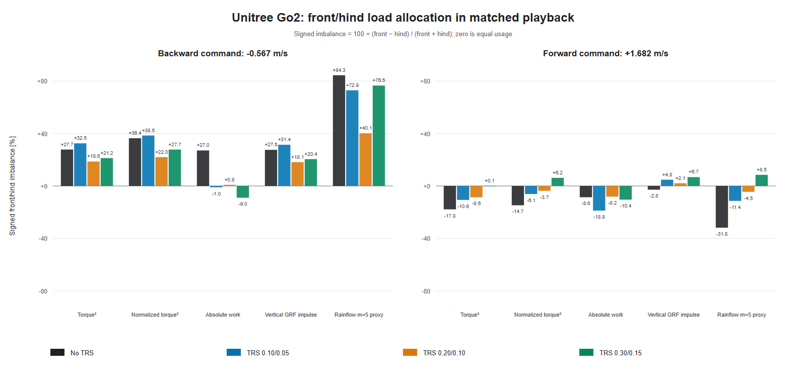
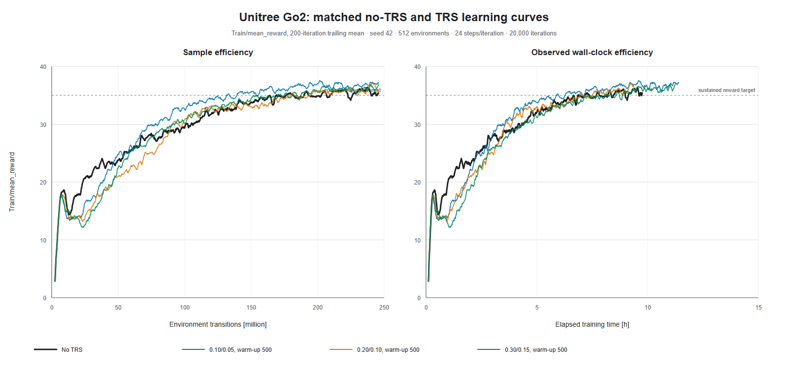

# Go2 TRS four-run load-allocation and sample-efficiency study

Date: 2026-08-02

## Executive conclusion

The four matched runs show a coefficient-dependent trade-off, not a monotonic
"more TRS is better" effect.

- **TRS 0.20/0.10 is the strongest measured durability compromise.** It gives
  the lowest direction-equal imbalance for normalized torque, absolute work,
  cyclic-load severity, and vertical ground-reaction impulse. Relative to no
  TRS, its combined dominant-pair and worst-joint rainflow `m=5` proxies fall
  4.7% and 41.3%, and it gives the strongest overall reduction in recorded foot
  impact peaks. This supports the narrow conclusion that one pair or joint is
  less likely to receive the most concentrated repetitive loading in this
  rollout. It does not prove a reduction in hardware failure probability.
- **TRS 0.10/0.05 is the clear sample-efficiency winner.** It reaches a
  sustained mean reward of 35 after 139.30 million transitions, versus 209.31
  million without TRS: 33.45% fewer samples. Its full-training reward AUC is
  3.19% higher and its last-1,000-iteration reward is 4.17% higher. Its load
  results are mixed, so this setting does not support a break-risk reduction
  claim.
- **TRS 0.30/0.15 is not the durability winner.** It has the best average
  torque-squared balance and the lowest combined total torque-squared exposure,
  but combined dominant-pair and worst-joint `m=5` severity rise 25.7% and
  10.4% from baseline. It also has the largest joint-limit violation rate and
  0.259 m forward lateral drift. It is better described as a torque-allocation
  result than a safer policy.
- **TRS does not uniformly boost training.** All three TRS runs learn more
  slowly at the start. The 0.20/0.10 and 0.30/0.15 settings reach rewards 30
  and 35 with fewer samples than baseline, but their full reward AUCs remain
  3.20% and 1.30% lower. Only 0.10/0.05 improves the full reward AUC.

These are descriptive findings from one training seed and one recorded
two-command rollout per policy. They are not statistical evidence of a general
TRS effect and are not calibrated hardware failure probabilities.

## Compared runs

| Label | Archived run | Mirror/value coefficient | Warm-up |
|---|---|---:|---:|
| No TRS | `2026-07-31_22-48-10_go2_no_trs_20k_512` | 0 / 0 | Inert |
| TRS 0.10/0.05 | `2026-08-01_11-09-46_go2_trs_m0p1_v0p05_w500_minv0_20k_512` | 0.10 / 0.05 | 500 |
| TRS 0.20/0.10 | `2026-07-31_22-48-38_go2_trs_m0p2_v0p1_w500_20k_512` | 0.20 / 0.10 | 500 |
| TRS 0.30/0.15 | `2026-08-01_22-39-14_go2_trs_m0p3_v0p15_w500_minv0_20k_512` | 0.30 / 0.15 | 500 |

This is a strongly matched comparison:

- every run completed through `model_19999.pt`; the published archive retains
  that terminal checkpoint, 19,999 reward scalar points, and the same
  72-input, 12-output actor dimensions;
- all runs use seed 42, 512 environments, 24 steps per environment, and 20,000
  iterations: 12,288 transitions per iteration and 245.76 million transitions
  in total;
- resolved environment YAML files differ only in `log_dir`;
- resolved agent YAML files differ only in `run_name`, mirror-loss enable,
  mirror coefficient, and TR value coefficient;
- PPO, network, optimizer, reward, randomization, command, and task settings are
  otherwise identical, and `use_data_augmentation` is false in all four runs;
- each TRS auxiliary-loss trace is zero through iteration 499 and first becomes
  nonzero at iteration 500;
- archived code-provenance diffs are byte-identical; and
- recorded time, desired command, desired path, terminal flags, joint/leg
  ordering, gait targets, clearance targets, and swing weights are
  byte-identical across all four rollout archives.

The shared archived environment uses phase mapping version
`same_gait_backward_duty_aware_trs_v2` and `min_xy_command_norm=0.0`.

## Matched playback and analysis method

Each final-policy archive contains 1,500 samples over 30 seconds at 50 Hz. The
identical command schedule is:

- backward: `vx=-0.566558 m/s`, `vy=0`, `yaw=0`, through 9.96 s;
- forward: `vx=+1.681907 m/s`, `vy=0`, `yaw=0`, from 9.98 s onward.

The steady windows are `[0.5, 9.5)` seconds backward and `[10.5, 29.5)` seconds
forward. This excludes startup and the command transition. All four policies
survive to the common final time limit; there are no early episode ends.
Front means FL+FR and hind means RL+RR. Forces include friction.

Signed pair imbalance is

```text
100 * (front - hind) / (front + hind)
```

Positive values are front-biased, negative values are hind-biased, and zero is
equal allocation. The direction-equal mean below averages the absolute
backward and forward imbalance, preventing the longer forward segment from
dominating. CSV confidence intervals use 20,000 one-second temporal block
bootstrap replicates. They measure within-rollout temporal variability, not
uncertainty across training seeds.

Rainflow quantities are effort-limit-normalized sensitivity proxies. They are
not Miner damage, S-N life, motor thermal damage, gearbox or bearing life, or
fracture probability.

## Are the front and hind legs used more evenly?

Yes for several TRS configurations and load measures, but the answer depends
on the coefficient and metric. The entries are absolute imbalance percentages;
lower is more even. Each cell is backward / forward.

| Metric | No TRS | TRS 0.10/0.05 | TRS 0.20/0.10 | TRS 0.30/0.15 |
|---|---:|---:|---:|---:|
| Torque-squared exposure | 27.72 / 17.83 | 32.48 / 10.65 | **18.63 / 8.61** | 21.20 / **0.07** |
| Normalized torque exposure | 36.36 / 14.72 | 38.45 / 6.15 | **21.97 / 3.73** | 27.73 / 6.17 |
| Absolute work | 27.04 / 8.61 | 0.99 / 18.78 | **0.85 / 8.18** | 8.98 / 10.41 |
| Rainflow `m=3` proxy | 57.39 / 10.95 | 46.37 / 8.62 | **24.01 / 1.64** | 52.51 / 4.06 |
| Rainflow `m=5` proxy | 84.34 / 31.79 | 72.87 / 11.39 | **40.10 / 4.47** | 76.52 / 8.48 |
| Vertical GRF impulse | 27.51 / 2.84 | 31.37 / 4.76 | **18.13 / 2.06** | 20.43 / 6.71 |
| Contact duration | **4.97** / 2.19 | 9.68 / 1.94 | 8.44 / 0.89 | 9.00 / **0.87** |

Direction-equal means make the coefficient trade-off clearer. Parentheses are
changes from no TRS; a negative change means more even allocation.

| Metric | No TRS | TRS 0.10/0.05 | TRS 0.20/0.10 | TRS 0.30/0.15 |
|---|---:|---:|---:|---:|
| Torque-squared exposure | 22.78% | 21.56% (-5.3%) | 13.62% (-40.2%) | **10.64% (-53.3%)** |
| Normalized torque exposure | 25.54% | 22.30% (-12.7%) | **12.85% (-49.7%)** | 16.95% (-33.6%) |
| Absolute work | 17.82% | 9.89% (-44.5%) | **4.51% (-74.7%)** | 9.70% (-45.6%) |
| Rainflow `m=5` proxy | 58.06% | 42.13% (-27.4%) | **22.29% (-61.6%)** | 42.50% (-26.8%) |
| Vertical GRF impulse | 15.18% | 18.07% (+19.0%) | **10.10% (-33.5%)** | 13.57% (-10.6%) |
| Contact duration | **3.58%** | 5.81% (+62.1%) | 4.66% (+30.1%) | 4.94% (+37.8%) |

Contact duration is not load magnitude: a pair can be on the ground longer but
carry less work or impulse. TRS 0.30/0.15 nearly equalizes forward
torque-squared exposure, but its backward cyclic loading remains strongly
front-biased. TRS 0.20/0.10 is the only setting that consistently improves
direction-conditioned torque, work, cyclic-severity, and GRF allocation.



## Is one leg pair less likely to be overloaded or broken?

The measured proxies favor TRS 0.20/0.10 for reducing *concentration*, but no
run establishes actual break probability. The combined values below sum the
two steady windows and divide by their combined directed distance.

| Combined proxy per directed metre | No TRS | TRS 0.10/0.05 | TRS 0.20/0.10 | TRS 0.30/0.15 |
|---|---:|---:|---:|---:|
| Total torque-squared | 487.77 | 482.66 | 497.19 | **469.46** |
| Total absolute work [J/m] | **169.76** | 188.30 | 181.58 | 183.77 |
| Total rainflow `m=5` | **0.15106** | 0.22526 | 0.17003 | 0.20097 |
| Dominant-pair rainflow `m=5` | 0.09114 | 0.11831 | **0.08684** | 0.11457 |
| Worst-joint rainflow `m=5` | 0.06175 | 0.06248 | **0.03626** | 0.06817 |
| Total vertical GRF impulse [N s/m] | 131.59 | 126.33 | **125.48** | 125.54 |
| Per-leg `m=5` max:min ratio | 5.68 | 2.04 | **1.71** | 2.73 |

All TRS policies reduce the per-leg spread, but 0.20/0.10 is the most even and
the only setting that lowers both dominant-pair and worst-joint cyclic severity
from baseline. Its dominant-pair reduction is modest when both command windows
are distance-weighted (-4.7%), while the worst-joint reduction is large
(-41.3%). Total `m=5` exposure rises 12.6%, showing that redistribution and
total loading are distinct.

The combined per-leg `m=5` values, in FL / FR / RL / RR order, are:

| Policy | FL | FR | RL | RR |
|---|---:|---:|---:|---:|
| No TRS | 0.03654 | 0.02337 | 0.01364 | **0.07750** |
| TRS 0.10/0.05 | 0.03747 | 0.06948 | 0.04192 | **0.07640** |
| TRS 0.20/0.10 | 0.03826 | 0.04493 | 0.03210 | **0.05473** |
| TRS 0.30/0.15 | 0.03441 | **0.08016** | 0.02941 | 0.05699 |

Impact results also favor 0.20/0.10 overall. Its worst foot-force peak is
123.4 N backward and 191.9 N forward, versus 279.3 N and 212.0 N without TRS.
The 0.30/0.15 setting similarly improves backward impact (122.0 N) but is
nearly baseline forward (208.9 N). The 0.10/0.05 setting leaves backward impact
essentially unchanged (278.8 N).

Important opposing indicators prevent a stronger safety claim:

- every TRS run uses more mechanical work per distance than no TRS;
- worst forward normalized-torque peaks are 0.830, 0.875, 0.912, and 0.916
  for no TRS, 0.10/0.05, 0.20/0.10, and 0.30/0.15 respectively;
- recorded forward joint-position-limit violation fractions are 0.281%,
  0.675%, 0.798%, and 1.430% in the same order;
- corresponding last-1,000-iteration training diagnostics are 0.360%, 0.847%,
  0.728%, and 0.950%; and
- 0.30/0.15 has 0.259 m forward lateral drift, versus 0.066 m without TRS,
  0.006 m for 0.10/0.05, and 0.042 m for 0.20/0.10.

The defensible durability statement is therefore:

> In this matched two-command rollout, TRS 0.20/0.10 most consistently reduces
> front/hind specialization, worst-joint cyclic severity, and foot-impact
> extremes. That plausibly reduces preferential wear of one leg pair, but
> overall component break probability remains unproven because total work,
> total cyclic exposure, and joint-limit exposure do not all improve.

TRS 0.10/0.05 offers partial redistribution but no overall durability benefit.
TRS 0.30/0.15 improves torque balance while worsening the more failure-relevant
cyclic and joint-limit indicators; it should not be selected as the safer
setting from these data.

## Does TRS improve training or sample efficiency?

The plot uses a 200-iteration trailing mean. A threshold is recorded only when
the rolling mean remains beyond it for 500 consecutive iterations. AUC values
are calculated from raw TensorBoard scalars over aligned iteration budgets, not
from the displayed smoothed curves.



| Training metric | No TRS | TRS 0.10/0.05 | TRS 0.20/0.10 | TRS 0.30/0.15 |
|---|---:|---:|---:|---:|
| Reward AUC, first 10k | 24.771 | **25.121 (+1.41%)** | 22.884 (-7.62%) | 23.474 (-5.24%) |
| Reward AUC, full 20k | 29.689 | **30.636 (+3.19%)** | 28.740 (-3.20%) | 29.305 (-1.30%) |
| Reward, last 1,000 | 35.531 ± 1.215 | **37.013 ± 0.888** | 36.280 ± 1.141 | 36.366 ± 1.128 |
| Sustained reward 30 | 8,669 / 106.52M | **6,539 / 80.35M (-24.57%)** | 7,995 / 98.24M (-7.78%) | 7,535 / 92.59M (-13.08%) |
| Sustained reward 35 | 17,034 / 209.31M | **11,336 / 139.30M (-33.45%)** | 15,845 / 194.70M (-6.98%) | 15,249 / 187.38M (-10.48%) |
| Sustained XY error ≤0.15 | 15,106 / 185.62M | **12,707 / 156.14M (-15.88%)** | 14,543 / 178.70M (-3.73%) | 12,729 / 156.41M (-15.74%) |
| Episode length, last 1,000 | 1,374.8 | **1,405.2** | 1,395.4 | 1,400.4 |
| XY velocity error, last 1,000 | 0.1423 | **0.1354** | 0.1440 | 0.1432 |

All three TRS conditions impose an early learning cost: sustained reward 20
requires 64-97% more samples than baseline. The 0.10/0.05 curve then recovers,
becomes persistently higher than the baseline after about iteration 5,072, and
is the only TRS run with a positive full-budget reward AUC. It provides the
strongest descriptive evidence of improved sample efficiency.

The 0.20/0.10 and 0.30/0.15 conditions do reach the sustained reward targets
with 7-13% fewer samples, and both finish above baseline. However, their lower
integrated reward means they do not show a broad training-efficiency boost over
the full 20,000-iteration budget. Increasing the coefficients does not improve
sample efficiency monotonically.

Observed wall times are 9.76, 11.39, 9.44, and 11.23 hours in coefficient order.
The July jobs ran concurrently and the August jobs saw different host loads, so
wall time and FPS are not controlled. The right plot panel is descriptive only;
environment transitions are the valid comparison axis.

## Limitations and required follow-up

1. There is one training seed per condition. No uncertainty across PPO runs can
   be estimated, and on-policy training return is not held-out performance.
2. There is one 30-second rollout per policy with only two unequal straight-line
   commands. It does not cover turning, all gait rows, terrain, payload, pushes,
   or long duty cycles.
3. The NPZ does not encode the checkpoint filename, playback seed, initial root
   orientation/angular state, or realized random push. Folder placement,
   timestamps, seed/config equality, and matched saved targets support the
   pairing, but those reset details cannot be independently verified.
4. Gait-row, theta, phase, and explicit disturbance draws were not saved. The
   gait target arrays are identical, but the discrete row cannot be reconstructed
   independently.
5. The 50 Hz recorder may miss physics-substep impact peaks.
6. Isaac Lab does not model structural fracture, motor temperature, or the
   actuator, gearbox, bearing, geometry, material, and S-N data needed for a
   calibrated failure prediction.
7. Better front/hind balance is not equivalent to lower total exposure.

A confirmation study should use at least five paired training seeds and
repeated matched rollouts at forward/backward speeds, turns, every gait row,
terrain, payload, and push cases. Hardware durability claims additionally need
calibrated component load-life and thermal data.

## Artifacts and reproduction

This directory is the canonical four-run Phase Mapping V2 Go2 analysis.

- `learning_curve_sample_and_wall_time.svg`: vector learning-curve source.
- `learning_curve_sample_and_wall_time.png`: rendered preview used above.
- `front_hind_signed_imbalance.svg`: vector pair-allocation plot.
- `front_hind_signed_imbalance.png`: rendered preview used above.
- `training_efficiency.csv`: reward, threshold, tracking, runtime, auxiliary
  loss, action, joint-limit, and termination summaries.
- `learning_curve_points.csv`: exact displayed reward-curve points.
- `front_hind_metrics.csv`: pair integrals, per-distance values, imbalance, and
  temporal-bootstrap intervals.
- `durability_risk_summary.csv`: tracking, total exposure, dominant-pair, and
  worst-component durability proxies.
- `summary.json`: complete machine-readable output and artifact hashes.
- `study.json`: immutable robot/run metadata for the shared analysis method.
- `reproduce.py`: compatibility wrapper for the maintained shared engine at
  `scripts/symm_locomotion/analyze_matched_trs_study.py`.

From the repository root, regenerate the CSV, JSON, and SVG artifacts with:

```powershell
python .\logs\rsl_rl\good_runs\unitree_go2_symm_flat\phase_mapping_v2_go2_trs_run_analysis\reproduce.py
```

The published run directories named by `study.json` contain the required
paired inputs, provenance, event logs, and terminal checkpoints. The engine
validates those artifacts before regenerating the tables, JSON, and SVGs; a
fresh latest-only clone records initial-checkpoint revalidation as unavailable.
